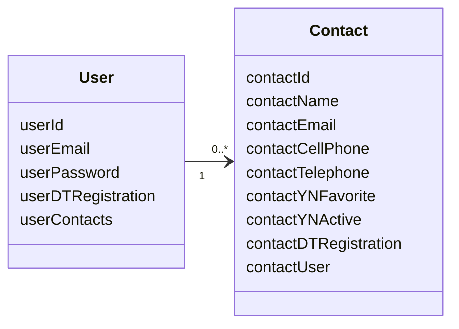

# Aplicação de Agenda de Contatos - Backend

## Descrição

Este projeto é uma **Agenda Telefônica** online, desenvolvida para facilitar o gerenciamento de contatos pessoais ou empresariais.  
A aplicação permite **cadastrar**, **visualizar**, **editar**, **excluir** ou **desativar** contatos.  
Cada contato pode conter informações como **nome**, **telefone**, **celular**, **email** e um **status de favorito**.  
O backend foi construído utilizando **Spring Boot**, oferecendo uma API REST segura e eficiente, com autenticação baseada em **JWT** e autorização via **OAuth**.  
A persistência dos dados é realizada em um banco de dados **Postgres**.

## Badges

### Back-end:

  
  
  
  
  
  

### Database:

    
  

## Tecnologias Utilizadas

- **Backend**: [Spring Boot](https://spring.io/projects/spring-boot) - Framework para gerenciamento da lógica de negócios e persistência de dados.
- **Autenticação**: [JSON Web Tokens (JWT)](https://jwt.io/) - Para criação e verificação de tokens de autenticação.
- **Autorização**: [OAuth](https://oauth.net/2/) - Para garantir autorização robusta e segura.
- **Banco de Dados**: [Postgres](https://www.postgresql.org/) - Sistema de gerenciamento de banco de dados relacional.

## Testes Unitários

A aplicação também conta com uma camada de testes automatizados utilizando **JUnit 5** e **Mockito**.  
Os testes são focados nas operações de persistência de dados.

### Frameworks de Teste Utilizados:
- [JUnit 5](https://junit.org/junit5/) - Plataforma para escrita e execução dos testes unitários.
- [Mockito](https://site.mockito.org/) - Framework para criação de objetos simulados (mocks) e verificação de comportamentos.

### Cobertura de Testes:
- **Controladores**: Testes dos endpoints REST utilizando o `MockMvc`.

## Fluxo de Trabalho (Backend)

1. **Login**: Usuário insere credenciais e, após autenticação bem-sucedida, um **token JWT** é gerado para gerenciar a sessão.

2. **Gerenciamento de Contatos**:
   - **Cadastro de Contato** (`POST`): Adiciona um novo contato.
   - **Listagem de Contatos** (`GET`): Retorna a lista de contatos cadastrados.
   - **Consulta de Contato** (`GET`): Retorna os detalhes de um contato específico.
   - **Atualização de Contato** (`PUT`): Atualiza informações de um contato existente.
   - **Exclusão de Contato** (`DELETE`): Remove um contato do banco de dados.

3. **Persistência de Dados**:
   - As informações dos contatos são armazenadas no banco de dados **Postgres**.
   - O **Spring Data JPA** é utilizado para facilitar operações de CRUD (Create, Read, Update, Delete).
  
## Diagrama UML (Classes)

## Conclusão

O backend da aplicação combina a robustez do **Spring Boot** para gerenciar dados e a lógica de negócios, com a segurança proporcionada pelo **JWT** e **OAuth**. A integração com **Postgres** garante a persistência eficiente dos dados, proporcionando uma solução escalável e segura.
